```{r setup, include=FALSE}
knitr::opts_chunk$set(echo = FALSE)
library(tidyverse)
```

## Initial Inquiries
- Can we predict the time it takes for the Portland Police Bureau to respond to calls?  
- What can we say about the influence that race and wealth have on the reaction time of police?  

## Our Data
We combined two data sets: 2010 Census Bureau Data and 2012 Portland Police Bureau Data on Dispatched Calls and Portland Monthly income data.
Our variables:  
-Neighborhood  
-Priority  
-Percent of Population that's White  
-Population Density  
-Mean Income 
Our dependent variable:
-Time in Queue

## Portland | Choropleth Map of Peoples Below Poverty Level 
```{r echo=FALSE, out.width="70%", fig.align = "center"}
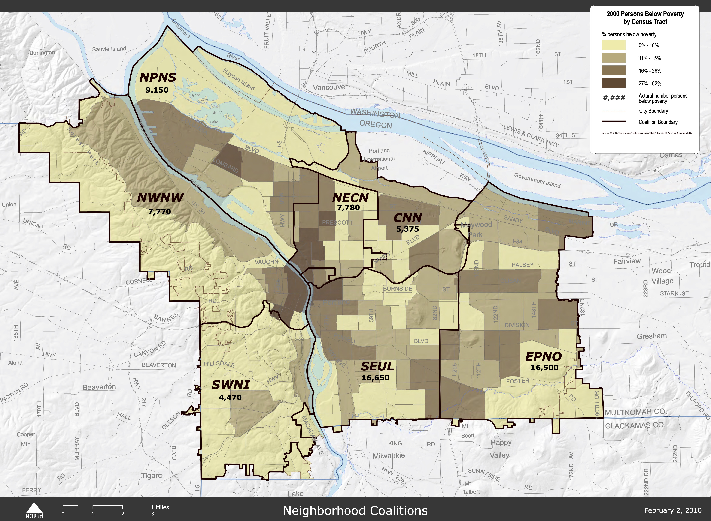
#source of image: https://www.portlandonline.com/portlandplan/index.cfm?c=52257&a=288632
```

## Portland | Choropleth Map of Household Income by Range
```{r echo=FALSE, out.width="70%", fig.align = "center"}
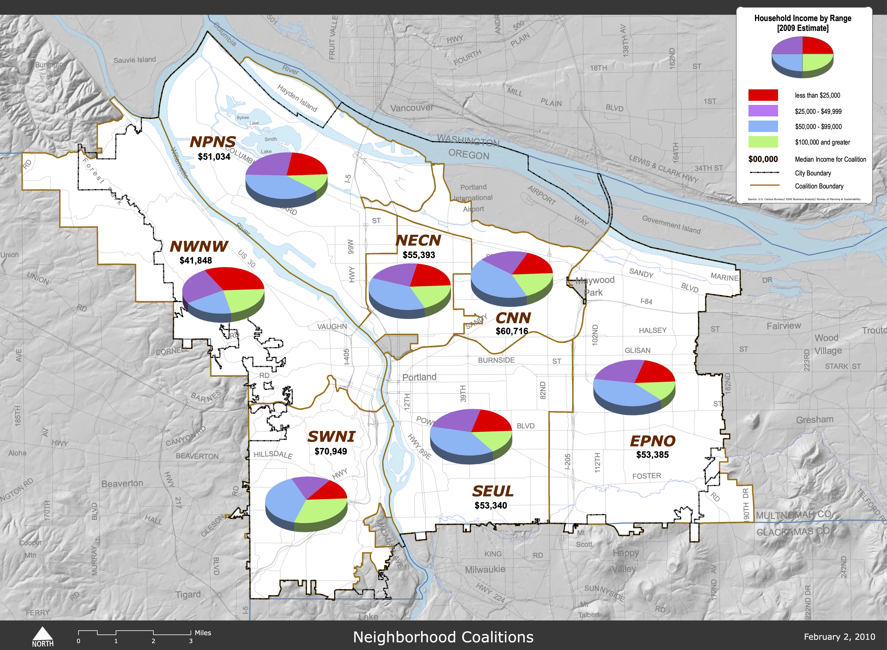
#source of image: https://www.portlandonline.com/portlandplan/index.cfm?c=52257&a=288629
```

## Portland | Choropleth Map of Average Response Time
```{r echo=FALSE, out.width="110%", fig.align = "center"}
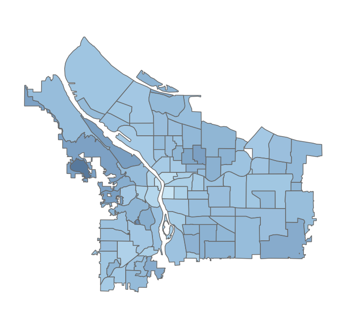
#source of image:https://www.portlandoregon.gov/police/76454
```

## Portland | Choropleth Map of Number of Dispatches
```{r echo=FALSE, out.width="110%", fig.align = "center"}
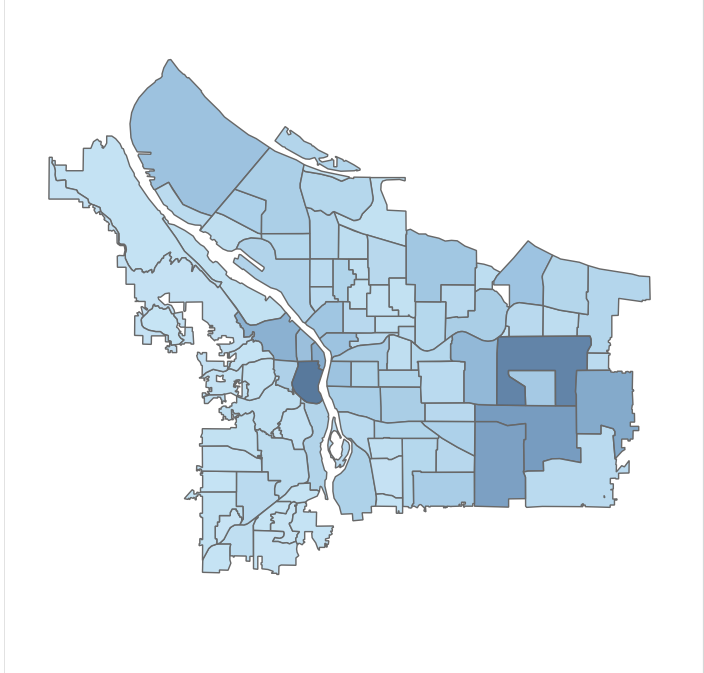
#source of image:https://www.portlandoregon.gov/police/76454
```

## Methods | Analysing Data
Approaches in Analysing Data:  
- Bivariate Analysis  
- PCA  

## Queue Time Frequency

```{r  echo=FALSE, out.width="70%", fig.align = "center"}
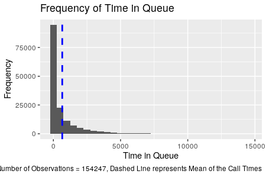
```

## Bivariate Analysis | Race and Priority

```{r  echo=FALSE, out.width="70%", fig.align = "center"}
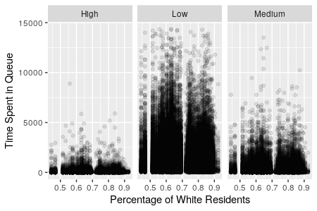
```

## Bivariate Analysis | Population Density and Priority
```{r  echo=FALSE, out.width="70%", fig.align = "center"}
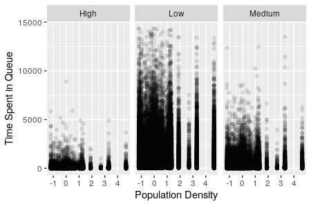
```

## Bivariate Analysis | Mean Income
```{r  echo=FALSE, out.width="70%", fig.align = "center"}
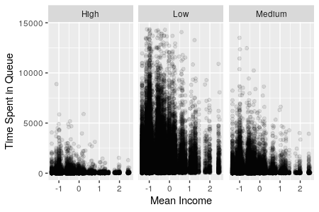
```

## PCA | Screeplot
```{r  echo=FALSE, out.width="70%", fig.align = "center"}
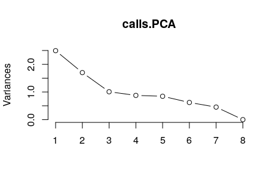
```

## Data Analysis | Initial Assessment
-Priority of Call

-Low Racial Diversity


## Methods | Prediction Models
Attempted Models:

-Linear Regression

-Ridge Regression

-Lasso

-Regression Tree

-Boosted Tree

-Random Forest

## Model Building | Linear Regression

```{r echo=FALSE, out.width="70%", fig.align = "center"}
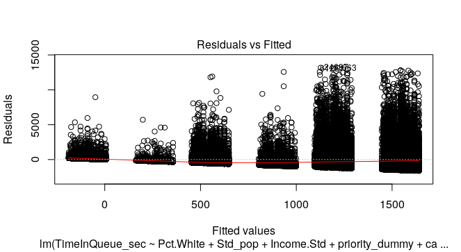
```

## Model Building | Linear Regression

```{r echo=FALSE, out.width="70%", fig.align = "center"}
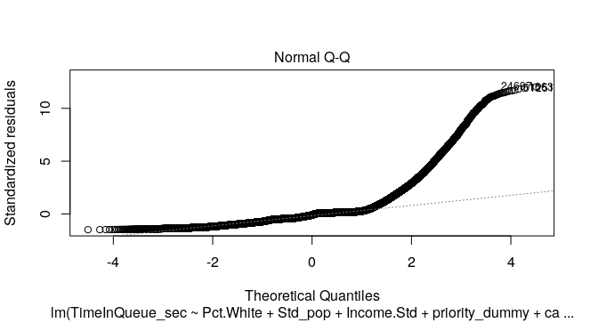
```

## Model Building | Linear Regression

```{r echo=FALSE, out.width="70%", fig.align = "center"}
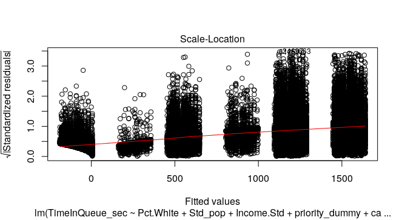
```

## Model Building | Linear Regression

```{r echo=FALSE, out.width="70%", fig.align = "center"}
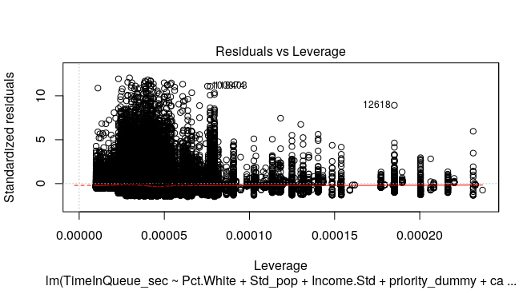
```


## Model Building with caretEnsemble
```{r caret list}
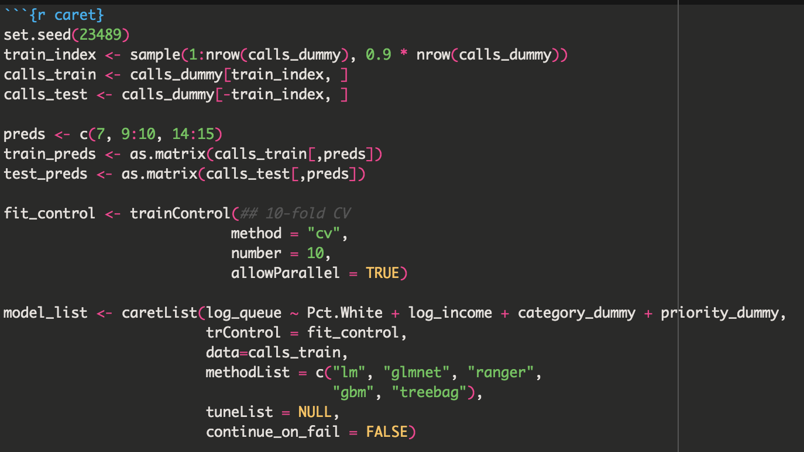
```


## Model Building with caretEnsemble
```{r caret mses}
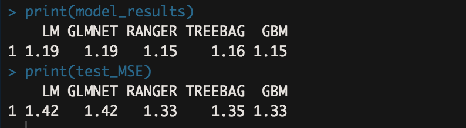
```

## Results
```{r varimp}
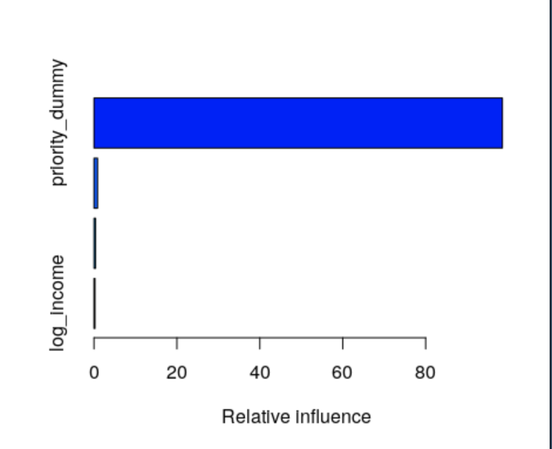
```

## Results
```{r varimp 2}
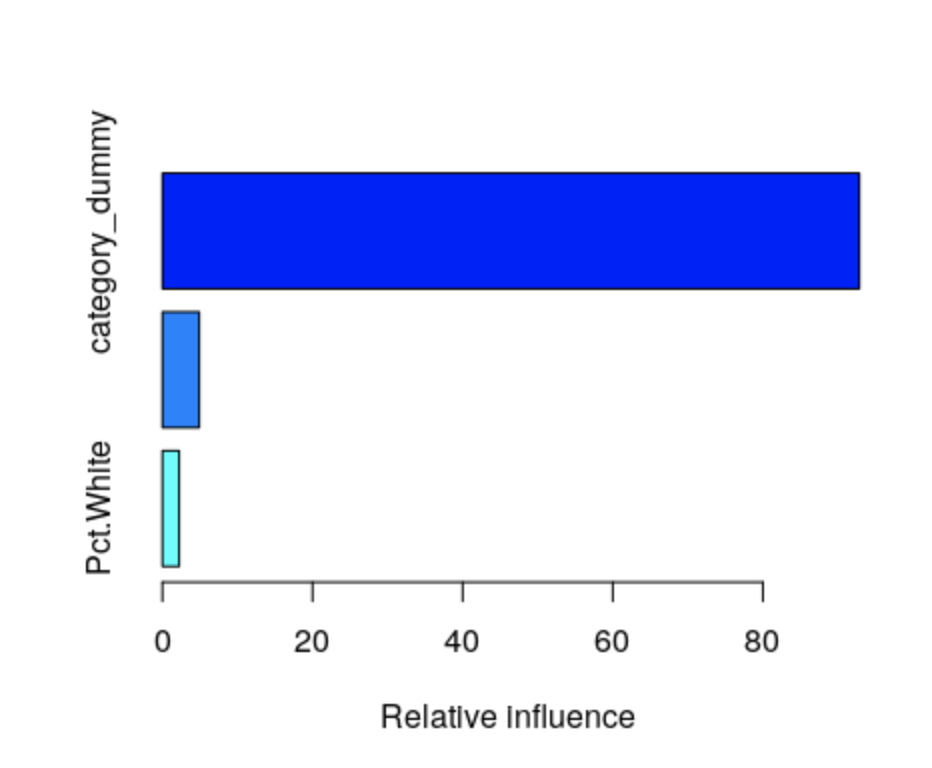
```

## Results
```{r varimp 3}
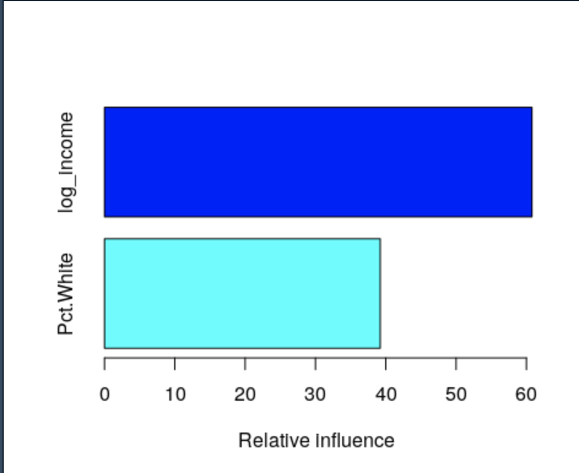
```

## Results
```{r regression table}
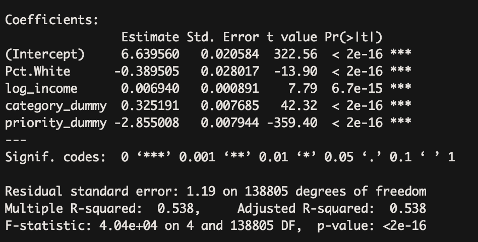
```


## Challenges
Dataset

- size

- skew

- variations among models

- not standardized between cities


## Conclusion
Best Model: GBM Boosted Random Forest  
Strongest Predictor: Income (excluding call priority and type of call)  

## Citation
PPB Data: (https://www.portlandoregon.gov/police/76454.)
Census Data: (https://www.portlandoregon.gov/civic/56897)
Population and Economic Data: (https://www.pdxmonthly.com/articles/2016/4/1/real-estate-2016-the-city)
Choropleth Data: https://www.portlandonline.com/portlandplan/index.cfm?c=51992
