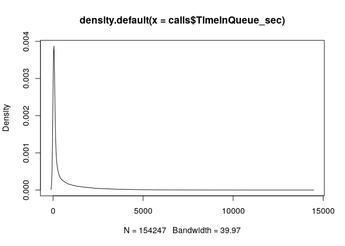
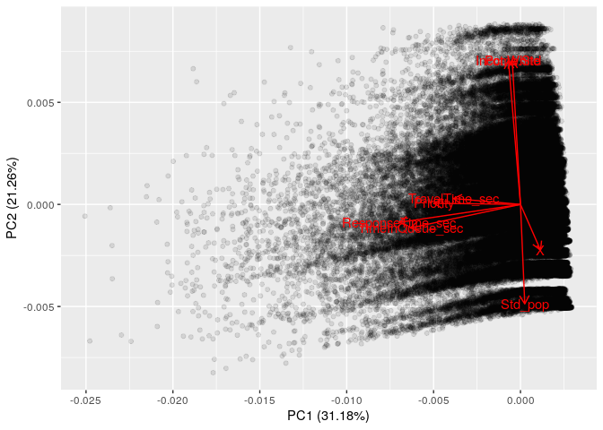

Our data is a combination of two different datasets. Census data from
2010 was taken from the City of Portland website
(<https://www.portlandoregon.gov/civic/56897>) and data about police
response time from 2012 was taken from the Portland Police Bureau
(<https://www.portlandoregon.gov/police/76454>.). Rather than using
total response time, we are using the time spent in the queue, that is,
the amount of time a caller waited in the police dispatch queue before
an officer was dispatched to them. The total response time includes
travel time once the officer was dispatched. As there is no record of
how far the officer had to travel, there was no way to standardize the
total response time, so we used the time spent in the queue as a more
standardized response time.

The unit of observation in this combined dataset is a call to the
Portland Police Bureau (PPB). The number of observations is 194,044. To
predict the time in queue of the PPB we are looking at priority of the
crime as rated by the PPB, racial makeup of the neighborhood (in
percentage of white population), population density, and average income
in the neighborhood.

Location data is majority of data that is missing in observations with
missing data. This is addressed by PPB on the website. If "the incident
occurred outside of the boundaries of the Portland neighborhoods or at a
location that could not be assigned to a specific address in the system
(e.g., Portland, near Washington Park, on the streetcar, etc.)" (PPB)
there will be no data for location.

Population and economic data came from Portland Monthly:
(<https://www.pdxmonthly.com/articles/2016/4/1/real-estate-2016-the-city>)

### Time in Queue for PPB calls

    library(tidyverse)

    ## ── Attaching packages ────────────────────────────────────────────────────────────────────────────────── tidyverse 1.2.1 ──

    ## ✔ ggplot2 3.2.1     ✔ purrr   0.3.2
    ## ✔ tibble  2.1.1     ✔ dplyr   0.8.3
    ## ✔ tidyr   1.0.0     ✔ stringr 1.4.0
    ## ✔ readr   1.3.1     ✔ forcats 0.4.0

    ## ── Conflicts ───────────────────────────────────────────────────────────────────────────────────── tidyverse_conflicts() ──
    ## ✖ dplyr::filter() masks stats::filter()
    ## ✖ dplyr::lag()    masks stats::lag()

    library(dplyr)
    library(ggplot2)
    library(ggfortify)
    library(glmnet)

    ## Loading required package: Matrix

    ## 
    ## Attaching package: 'Matrix'

    ## The following objects are masked from 'package:tidyr':
    ## 
    ##     expand, pack, unpack

    ## Loading required package: foreach

    ## 
    ## Attaching package: 'foreach'

    ## The following objects are masked from 'package:purrr':
    ## 
    ##     accumulate, when

    ## Loaded glmnet 2.0-16

    library(MLmetrics)

    ## 
    ## Attaching package: 'MLmetrics'

    ## The following object is masked from 'package:base':
    ## 
    ##     Recall

    library(tree)
    library(caret)

    ## Loading required package: lattice

    ## 
    ## Attaching package: 'caret'

    ## The following objects are masked from 'package:MLmetrics':
    ## 
    ##     MAE, RMSE

    ## The following object is masked from 'package:purrr':
    ## 
    ##     lift

    library(randomForest)

    ## randomForest 4.6-14

    ## Type rfNews() to see new features/changes/bug fixes.

    ## 
    ## Attaching package: 'randomForest'

    ## The following object is masked from 'package:dplyr':
    ## 
    ##     combine

    ## The following object is masked from 'package:ggplot2':
    ## 
    ##     margin

    library(gbm)

    ## Loaded gbm 2.1.5

    calls <- read.csv("https://raw.githubusercontent.com/stat-learning/group-1/master/calls.csv")

    dens <- density(calls$TimeInQueue_sec)
    plot(dens)

    summary(calls$TimeInQueue_sec)

    ##    Min. 1st Qu.  Median    Mean 3rd Qu.    Max. 
    ##     0.0    37.0   114.0   660.5   686.0 14359.0

    ggplot(data = calls, mapping = aes(x = Pct.White,
                                       y = TimeInQueue_sec)) +
    geom_point(alpha = 0.1)+
    labs(x = "Percentage of White Residents", y = "Time Spent in Queue")

    #same as above but faceted by priority
    ggplot(data = calls, mapping = aes(x = Pct.White,
                                       y = TimeInQueue_sec)) +
    geom_point(alpha = 0.1) +
    facet_wrap(~Priority, ncol = 3) +
    labs(x = "Percentage of White Residents", y = "Time Spent in Queue")

    #population density represented by its z-score
    ggplot(data = calls, mapping = aes(x = Std_pop,
                                       y = TimeInQueue_sec)) +
    geom_point(alpha = 0.1)+
    labs(x = "Population Density", y = "Time Spent in Queue")

    #same as above but faceted by priority
    ggplot(data = calls, mapping = aes(x = Std_pop,
                                       y = TimeInQueue_sec)) +
    geom_point(alpha = 0.1) +
    facet_wrap(~Priority, ncol = 3) +
    labs(x = "Population Density", y = "Time Spent in Queue")

    ggplot(data = calls, mapping = aes(x = Income.Std,
                                       y = TimeInQueue_sec)) +
    geom_point(alpha = 0.1)+
    labs(x = "Mean Income", y = "Time Spent in Queue")

    #same as above but faceted by priority
    ggplot(data = calls, mapping = aes(x = Income.Std,
                                       y = TimeInQueue_sec)) +
    geom_point(alpha = 0.1) +
    facet_wrap(~Priority, ncol = 3) +
    labs(x = "Mean Income", y = "Time Spent in Queue")

    #removing the categorical variables
    numericalCalls<-calls[-c(2:4)]
    #chaning the priorities into numerical values.
    numericalCalls<-numericalCalls%>%mutate(Priority=case_when(
      Priority=="High" ~1,
      Priority=="Medium" ~2,
      Priority=="Low" ~3
    ))

    calls.PCA<-prcomp(numericalCalls, center=TRUE, scale.= TRUE)
    summary(calls.PCA)

    ## Importance of components:
    ##                           PC1    PC2    PC3    PC4    PC5     PC6     PC7
    ## Standard deviation     1.5793 1.3043 1.0043 0.9363 0.9192 0.78774 0.67361
    ## Proportion of Variance 0.3118 0.2126 0.1261 0.1096 0.1056 0.07757 0.05672
    ## Cumulative Proportion  0.3118 0.5244 0.6505 0.7601 0.8657 0.94328 1.00000
    ##                              PC8
    ## Standard deviation     6.828e-15
    ## Proportion of Variance 0.000e+00
    ## Cumulative Proportion  1.000e+00

    str(calls.PCA)

    ## List of 5
    ##  $ sdev    : num [1:8] 1.579 1.304 1.004 0.936 0.919 ...
    ##  $ rotation: num [1:8, 1:8] 0.101 -0.437 -0.61 -0.554 -0.337 ...
    ##   ..- attr(*, "dimnames")=List of 2
    ##   .. ..$ : chr [1:8] "X" "Priority" "ResponseTime_sec" "TimeInQueue_sec" ...
    ##   .. ..$ : chr [1:8] "PC1" "PC2" "PC3" "PC4" ...
    ##  $ center  : Named num [1:8] 77124 2.04 1104.29 660.47 443.81 ...
    ##   ..- attr(*, "names")= chr [1:8] "X" "Priority" "ResponseTime_sec" "TimeInQueue_sec" ...
    ##  $ scale   : Named num [1:8] 4.45e+04 8.56e-01 1.46e+03 1.26e+03 5.73e+02 ...
    ##   ..- attr(*, "names")= chr [1:8] "X" "Priority" "ResponseTime_sec" "TimeInQueue_sec" ...
    ##  $ x       : num [1:154247, 1:8] 1.123 1.0285 0.0216 1.2264 1.1701 ...
    ##   ..- attr(*, "dimnames")=List of 2
    ##   .. ..$ : NULL
    ##   .. ..$ : chr [1:8] "PC1" "PC2" "PC3" "PC4" ...
    ##  - attr(*, "class")= chr "prcomp"

    autoplot(calls.PCA, alpha=0.1, loadings=TRUE, loadings.label=TRUE)

    priority_dummy <- NULL
    priority_dummy[calls$Priority == "Low"] = 0
    priority_dummy[calls$Priority == "Medium"] = 0.5
    priority_dummy[calls$Priority == "High"] = 1

    category_dummy <- NULL
    category_dummy[calls$FinalCallGroup == "Traffic"] = 0
    category_dummy[calls$FinalCallGroup == "Disorder"] = 0
    category_dummy[calls$FinalCallGroup == "Community Policing"] = 0
    category_dummy[calls$FinalCallGroup == "Assist"] = 0
    category_dummy[calls$FinalCallGroup == "Other"] = 0
    category_dummy[calls$FinalCallGroup == "Alarm"] = 0
    category_dummy[calls$FinalCallGroup == "Civil"] = 0
    category_dummy[calls$FinalCallGroup == "Crime"] = 1

    calls_dummy <- mutate(calls, priority_dummy)
    calls_dummy <- mutate(calls_dummy, category_dummy)

    fisher_pop <- atanh(calls_dummy$Std_pop)

    ## Warning in atanh(calls_dummy$Std_pop): NaNs produced

    hist(fisher_pop)

    fisher_income <- atanh(calls_dummy$Income.Std)

    ## Warning in atanh(calls_dummy$Income.Std): NaNs produced

    hist(fisher_income)

    log_queue <- log(calls_dummy$TimeInQueue_sec)
    hist(log_queue)

    calls_dummy <- add_column(calls_dummy, fisher_pop, .after = 9)
    calls_dummy <- add_column(calls_dummy, fisher_income, .after = 10)
    calls_dummy <- add_column(calls_dummy, log_queue, .after = 11)

    #remove negative infinity variables
    calls_dummy <- calls_dummy[!is.infinite(log_queue),]

    #without tranformed variables

    lm_base <- lm(TimeInQueue_sec ~ Pct.White +
                Std_pop +
                Income.Std +
                priority_dummy +
                category_dummy,
              data = calls_dummy)
    summary(lm_base)

    ## 
    ## Call:
    ## lm(formula = TimeInQueue_sec ~ Pct.White + Std_pop + Income.Std + 
    ##     priority_dummy + category_dummy, data = calls_dummy)
    ## 
    ## Residuals:
    ##     Min      1Q  Median      3Q     Max 
    ## -1634.4  -533.5  -105.2   180.0 13168.7 
    ## 
    ## Coefficients:
    ##                 Estimate Std. Error  t value Pr(>|t|)    
    ## (Intercept)     1502.924     22.279   67.460  < 2e-16 ***
    ## Pct.White       -451.016     28.606  -15.766  < 2e-16 ***
    ## Std_pop            8.719      1.980    4.403 1.07e-05 ***
    ## Income.Std        14.816      5.383    2.753  0.00591 ** 
    ## priority_dummy -1283.701      6.965 -184.320  < 2e-16 ***
    ## category_dummy   350.753      6.740   52.038  < 2e-16 ***
    ## ---
    ## Signif. codes:  0 '***' 0.001 '**' 0.01 '*' 0.05 '.' 0.1 ' ' 1
    ## 
    ## Residual standard error: 1094 on 154228 degrees of freedom
    ## Multiple R-squared:  0.2438, Adjusted R-squared:  0.2437 
    ## F-statistic:  9942 on 5 and 154228 DF,  p-value: < 2.2e-16

    #Checking the residual graphs
    plot(lm_base)

    # with transformed variables

    lm_transformed <- lm(log_queue ~ Pct.White +
                fisher_pop +
                fisher_income +
                priority_dummy +
                category_dummy,
              data = calls_dummy)
    summary(lm_transformed)

    ## 
    ## Call:
    ## lm(formula = log_queue ~ Pct.White + fisher_pop + fisher_income + 
    ##     priority_dummy + category_dummy, data = calls_dummy)
    ## 
    ## Residuals:
    ##     Min      1Q  Median      3Q     Max 
    ## -5.6612 -0.8024 -0.0219  0.8059  5.1023 
    ## 
    ## Coefficients:
    ##                 Estimate Std. Error  t value Pr(>|t|)    
    ## (Intercept)     6.636918   0.029721  223.309  < 2e-16 ***
    ## Pct.White      -0.409728   0.038218  -10.721  < 2e-16 ***
    ## fisher_pop      0.035732   0.007134    5.009 5.50e-07 ***
    ## fisher_income   0.024421   0.005330    4.582 4.62e-06 ***
    ## priority_dummy -2.825293   0.010699 -264.071  < 2e-16 ***
    ## category_dummy  0.339909   0.010443   32.550  < 2e-16 ***
    ## ---
    ## Signif. codes:  0 '***' 0.001 '**' 0.01 '*' 0.05 '.' 0.1 ' ' 1
    ## 
    ## Residual standard error: 1.178 on 75788 degrees of freedom
    ##   (78440 observations deleted due to missingness)
    ## Multiple R-squared:  0.5333, Adjusted R-squared:  0.5332 
    ## F-statistic: 1.732e+04 on 5 and 75788 DF,  p-value: < 2.2e-16

    #Checking the residual graphs - these look a lot better
    plot(lm_transformed)

    lambdas <- 10^seq(3, -2, by = -.1)

    y <- calls_dummy[,12]
    cols <- c(9:11,15, 16)
    x <- calls_dummy[,cols]

    #this one won't work  :(

    # ridge <- glmnet(x, y, alpha = 0, lambda = lambdas, standardize = TRUE)

    # lasso <- glmnet(x, y, alpha = 1, lambda = lambdas, standardize = TRUE)

    t1 <- tree(log_queue ~ Pct.White +
               fisher_pop +
              fisher_income +
               priority_dummy +
               category_dummy,
            data = calls_dummy)

    t1cv <- cv.tree(t1)
    t1cv$size[which.min(t1cv$dev)]

    ## [1] 3

    #best tree
    t1prune <- prune.tree(t1, best = 3)

    preds <- c(7, 9, 13:16)
    trees_preds <- as.data.frame(calls_dummy[,preds])

    rf <- randomForest(TimeInQueue_sec ~ ., 
               data = trees_preds)

    boosted_rf <- gbm(TimeInQueue_sec ~ .,  data = trees_preds, n.trees = 50, interaction.depth=1,
                            shrinkage = 0.1, distribution = "gaussian")

    #Five-fold CV
    k <- 5
    calls_dummy<-calls_dummy[sample(nrow(calls_dummy)),]
    MSE_i <- rep(NA, k)
    folds <- cut(seq(1,nrow(calls_dummy)),breaks=k,labels=FALSE)
    #Perform 5 fold cross validation
    for(i in 1:k){
        #Segement your data by fold using the which() function 
        testIndexes <- which(folds==i,arr.ind=TRUE)
        test_df <- calls_dummy[testIndexes, ]
        train_df <- calls_dummy[-testIndexes, ]
        
        
        
    cv_lm1 <- lm(log_queue ~ Pct.White +
                fisher_pop +
                fisher_income +
                priority_dummy +
                category_dummy,
              data = train_df)
      
      # use model to predict into test data set
    mp1_pred <- predict(cv_lm1, newdata = test_df,
              type = "response")
      
      # store MSE_i
      mse_i <- MSE(mp1_pred, test_df$TimeInQueue_sec)
      MSE_i[i] <- mse_i
    }
    # compute final MSE estimate
    mean(MSE_i)

    ## [1] NaN
